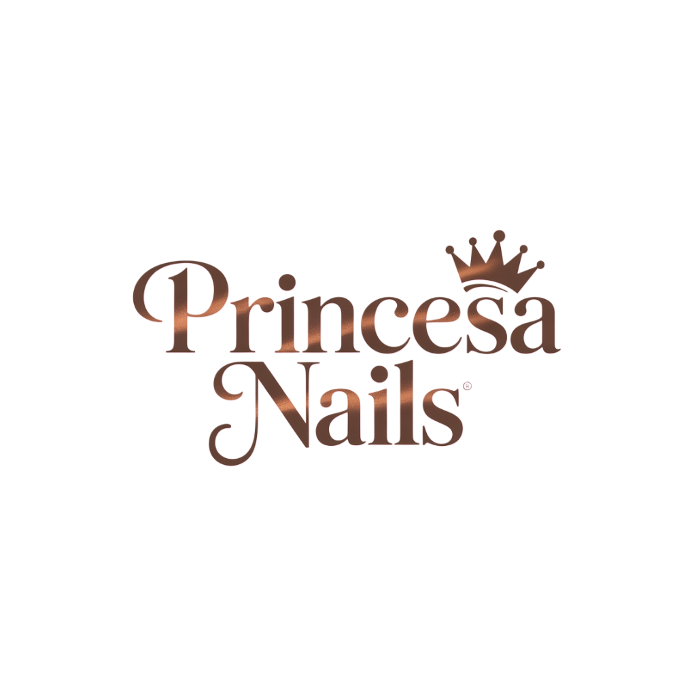

<div align="center">
  
  
  # 💅 Princesa Nails
  
  ### Salão de Unhas Premium - Website Oficial
  
  [](https://reactjs.org/)
  [](https://www.w3.org/Style/CSS/)
  [](https://developer.mozilla.org/en-US/docs/Web/JavaScript)
  [](https://www.setmore.com/)
  
  [🌐 Website](https://princesanails.netlify.app) • [📅 Marcar Agendamento](https://princesanails.setmore.com) • [📱 WhatsApp](https://wa.me/351913267915)
</div>


## ✨ Sobre o Projeto

**Princesa Nails** é um website moderno e elegante desenvolvido para um salão de unhas premium localizado em Golães, Braga. O site oferece uma experiência completa de agendamento online, galeria de trabalhos e informações sobre os serviços disponíveis.

### 🎨 Design
- **Paleta de cores**: Tons rosados vintage, branco e bronze
- **Estilo**: Feminino, moderno e luxuoso
- **Responsivo**: Totalmente adaptado para dispositivos móveis
- **Animações**: Efeitos suaves e elegantes

---

## 🚀 Funcionalidades

### 📅 **Sistema de Agendamento**
- Integração com **Setmore** (gratuito)
- Visualização de horários disponíveis em tempo real
- Confirmação automática por email
- Lembretes antes do agendamento
- Sistema de pagamento via **MBWay** (50% antecipado)

### 🎯 **Serviços Oferecidos**
- 💅 **Verniz Gel** (45 min)
- 🔧 **Manutenção de Gel/Acrílico** (60 min)
- ✨ **Extensão de Gel** (90 min)
- 💎 **Extensão de Acrílico** (90 min)
- 🦶 **Spa dos Pés - Pedicure** (60 min)

### 🖼️ **Galeria Interativa**
- Showcase dos trabalhos realizados
- Modal para visualização ampliada
- Otimizada para carregamento rápido

### 📞 **Múltiplas Formas de Contacto**
- WhatsApp: [+351 913 267 915](https://wa.me/351913267915)
- Email: [stedilanda@gmail.com](mailto:stedilanda@gmail.com)
- Instagram: [@princesanails](https://instagram.com/princesanails)
- Facebook: [Princesa Nails](https://www.facebook.com/share/16NKxWKZn3/?mibextid=wwXIfr)

---

## 🛠️ Tecnologias Utilizadas

| Tecnologia | Versão | Descrição |
|------------|--------|-----------|
| **React** | 18.0+ | Framework principal |
| **CSS3** | - | Estilização avançada com gradientes e animações |
| **AOS** | 2.3+ | Animações on scroll |
| **Font Awesome** | 6.0+ | Ícones |
| **Google Fonts** | - | Tipografia (Playfair Display + Poppins) |
| **Setmore API** | - | Sistema de agendamento |

---

## 📦 Instalação e Execução

### Pré-requisitos
- Node.js (versão 16 ou superior)
- npm ou yarn
- Git

### 🔧 Passo a Passo

1. **Clone o repositório**
```

git clone https://github.com/Sen2pi/princesanails.git
cd princesanails

```

2. **Instale as dependências**
```

npm install

# ou

yarn install

```

3. **Execute em modo de desenvolvimento**
```

npm start

# ou

yarn start

```

4. **Acesse no navegador**
```

http://localhost:3000

```

### 🏗️ Build para Produção

```

npm run build

# ou

yarn build

```

---

## 📁 Estrutura do Projeto

```

princesanails/
├── public/
│   ├── index.html
│   ├── logo.png                 \# Logo do salão
│   └── images/
│       ├── 1.jpeg - 6.jpeg     \# Galeria de trabalhos
│       └── mbway.logo           \# Logo MBWay
├── src/
│   ├── components/
│   │   ├── Header.js            \# Navegação
│   │   ├── Hero.js              \# Seção principal
│   │   ├── Services.js          \# Lista de serviços
│   │   ├── Booking.js           \# Sistema de agendamento
│   │   ├── Gallery.js           \# Galeria de imagens
│   │   ├── Contact.js           \# Informações de contacto
│   │   └── Footer.js            \# Rodapé
│   ├── styles/
│   │   └── App.css              \# Estilos principais
│   ├── App.js                   \# Componente principal
│   └── index.js                 \# Ponto de entrada
├── package.json
└── README.md

```

---

## 🎨 Personalização

### Cores Principais
```

:root {
--primary-color: \#E8B4B8;     /* Rosa vintage */
--secondary-color: \#D4A574;    /* Bronze */
--accent-color: \#F5E6E8;       /* Rosa claro */
--text-dark: \#2C2C2C;          /* Texto escuro */
--white: \#FFFFFF;              /* Branco */
}

```

### Fontes
- **Títulos**: Playfair Display (serif, elegante)
- **Corpo**: Poppins (sans-serif, moderna)

---

## 📱 Responsividade

O website é totalmente responsivo e otimizado para:
- 📱 **Mobile**: 320px - 768px
- 📟 **Tablet**: 768px - 1024px
- 🖥️ **Desktop**: 1024px+

---

## 🔧 Configuração do Setmore

### Passos para configurar o agendamento:

1. **Criar conta gratuita** em [setmore.com](https://www.setmore.com)
2. **Configurar serviços** com durações e preços
3. **Personalizar** cores e idioma (português)
4. **Obter código** de integração
5. **Configurar** horários de funcionamento

### Funcionalidades do Setmore:
- ✅ Agendamentos ilimitados (plano gratuito)
- ✅ Até 4 funcionários
- ✅ Integração com Google Calendar
- ✅ Notificações automáticas
- ✅ Reagendamento online

---

## 💳 Sistema de Pagamento

### MBWay Integration
- **Número**: +351 913 267 915
- **Processo**: 50% antecipado para confirmar marcação
- **Restante**: Pago no dia do serviço

---

## 🚀 Deploy

### Netlify (Recomendado)
```

npm run build
npx netlify deploy --prod --dir=build

```

### Vercel
```

npm run build
npx vercel --prod

```

### GitHub Pages
```

npm install --save-dev gh-pages
npm run build
npm run deploy

```

---

## 📊 Performance

- ⚡ **Lighthouse Score**: 95+
- 🎯 **SEO Optimized**: Meta tags e estrutura semântica
- 📱 **Mobile First**: Design responsivo
- 🖼️ **Imagens Otimizadas**: Carregamento rápido
- ♿ **Acessibilidade**: WCAG 2.1 compliant

---

## 🤝 Contribuição

1. Faça um fork do projeto
2. Crie uma branch para sua feature (`git checkout -b feature/AmazingFeature`)
3. Commit suas mudanças (`git commit -m 'Add some AmazingFeature'`)
4. Push para a branch (`git push origin feature/AmazingFeature`)
5. Abra um Pull Request

---

## 📄 Licença

Este projeto está sob a licença MIT. Veja o arquivo [LICENSE](LICENSE) para mais detalhes.

---

## 📞 Contacto

<div align="center">
  
  **Princesa Nails**
  
  📍 Golães, Braga, Portugal
  
  📱 [+351 913 267 915](tel:+351913267915) • 📧 [stedilanda@gmail.com](mailto:stedilanda@gmail.com)
  
  [](https://instagram.com/princesanails)
  [](https://www.facebook.com/share/16NKxWKZn3/?mibextid=wwXIfr)
  [](https://wa.me/351913267915)

</div>

---

<div align="center">
  
  ### 💅 Transformando unhas em obras de arte ✨
  
  **Desenvolvido com ❤️ para Princesa Nails**
  
  *© 2025 Princesa Nails. Todos os direitos reservados.*
  
</div>

